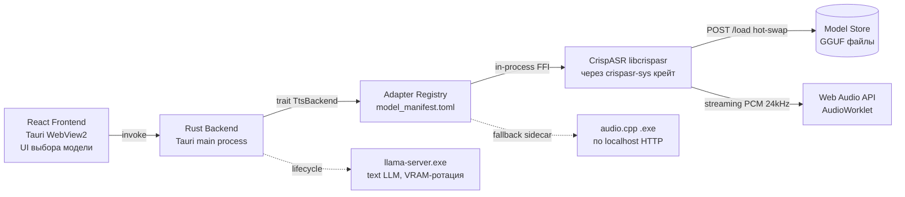

**llama.cpp НЕ поддерживает запуск GGUF TTS-моделей** (кроме Qwen3-TTS 1.7B Base, и то через draft PR с `/tts` endpoint). Все пять GGUF-репозиториев от `cstr`, `Serveurperso` и `BricksDisplay` предназначены для других движков — в первую очередь **CrispASR** и **audio.cpp**, а не для `llama.cpp`. Мой предыдущий ответ был неточным, когда говорил про «GGUF-формат поддерживается llama.cpp» — это верно только для текстовых LLM, но не для TTS-моделей. Признаю ошибку и даю ниже развёрнутую, проверенную картину.

## Что показал анализ 5 ссылок

| Репозиторий | Движок запуска (реальный) | Русский | Клонирование | Стриминг |
|---|---|---|---|---|
| `cstr/qwen3-tts-1.7b-voicedesign-GGUF` | **CrispASR** (`--backend qwen3-tts`, VoiceDesign-вариант)【turn0search0】 | ✅ (10 языков) | ✅ Voice Design + 3-сек клонирование | ✅ dual-track LM |
| `Serveurperso/OmniVoice-GGUF` | **omnivoice.cpp** (bluryar, C++/GGML) ИЛИ **CrispASR** (`cstr/omnivoice-GGUF`, backend `omnivoice`)【turn0search5】【turn4search5】 | ✅ (600+ языков) | ✅ zero-shot из WAV | ⚠️ есть в audio.cpp (Stream) |
| `BricksDisplay/Chatterbox-Multilingual-TTS-GGUF` | Карточка модели рекомендует **Python `chatterbox-tts`** (pip)【turn0search11】; нативно — **CrispASR** (`chatterbox` backend, EN/AR/DE) и **audio.cpp** (`chatterbox` family) | ⚠️ Заявлен в multilingual-версии (23 lang), но в CrispASR только EN/AR/DE; в audio.cpp RU отсутствует в языковом наборе | ✅ (baked voice GGUF / WAV) | ⚠️ не нативный |
| `cstr/cosyvoice3-0.5b-2512-GGUF` | **CrispASR** (`--backend cosyvoice3-tts`)【turn0search0】 | ✅ (9 языков + 18 китайских диалектов) | ✅ arbitrary-WAV cloning (`--voice <ref.wav> --ref-text`) | ✅ streaming-runtime |
| `cstr/bark-small-GGUF` | **CrispASR** (`bark` backend)【turn5fetch0】 | ✅ (multilingual) | ✅ через `.npz` speaker prompts | ⚠️ 3-stage GPT-2, тяжёлый для стриминга |

Ключевой вывод по `llama.cpp`: согласно официальному сравнению в репозитории CrispASR, `llama.cpp` поддерживает всего **7 аудио-моделей через libmtmd** (Voxtral, Qwen3-ASR, Qwen2.5/3 Omni — и это ASR/multimodal, не TTS)【turn2fetch0】. Единственный TTS, попавший в mainline `llama.cpp` — Qwen3-TTS 1.7B Base, и тот через draft PR, только Base-вариант, без CustomVoice/VoiceDesign【turn0search15】. CosyVoice3, Bark, Chatterbox, OmniVoice, VoxCPM2 в `llama.cpp` **не запускаются** — для каждой нужен свой C++-порт.

## Сравнение архитектурных подходов

| Критерий | А. Rust-крейт под каждую модель (`speakers-qwen3-tts`, `qwen3-tts-rs`, …) | Б. Единый движок (CrispASR / audio.cpp) + Rust-trait `TtsBackend` |
|---|---|---|
| Кол-во интеграций на N моделей | N крейтов, N API-поверхностей | 1 движок, 1 адаптер, N конфигов |
| Покрытие моделей сегодня | Только Qwen3-TTS (2–3 крейта) | 51 TTS-движок в CrispASR, 50+ семейств в audio.cpp【turn1fetch0】【turn5fetch0】 |
| Добавление новой модели | Ждать/писать новый Rust-крейт (недели–месяцы) | Скачать GGUF + добавить строку в manifest (минуты) |
| Удаление устаревшей модели | Убрать крейт из `Cargo.toml`, перелинковка | Удалить строку из manifest |
| Согласованность API | Каждый крейт — свой интерфейс, свои баги | Единый OpenAI-compatible `/v1/audio/speech` |
| Стриминг / barge-in | Реализовывать в каждом крейте отдельно | Единый streaming path во всех backends |
| Качество/поддержка | `TrevorS/qwen3-tts-rs` сам помечен «эксперимент, не production»【turn2search0】 | CrispASR v0.8.29, 6035 коммитов, 566★, активный релизный цикл |
| Rust-нативность | ✅ in-process, без IPC | ✅ через `crispasr-sys` / `crispasr` крейты (FFI, in-process)【turn2search9】【turn2search11】 |
| Зависимости | Только Rust + candle/ort | C++/GGML, но собирается cmake-ом из build.rs крейта |
| Windows-сборка | Просто `cargo build` | `build-windows.bat`, CUDA/Vulkan/CPU — работает【turn1fetch0】 |
| VRAM-менеджмент | Ручной в каждом крейте | Единый lifecycle: unload/load через `POST /load` |

**Вывод: подход Б (единый движок + trait) надёжнее и практичнее.** Плодить N Rust-крейтов под каждую модель — это воспроизвести внутри Rust всю работу, которую уже сделали авторы CrispASR (51 backend) и audio.cpp (50+ family), но с дроблением сил и отставанием. Pure-Rust крейты имеют смысл только как точечная оптимизация для одной-двух приоритетных моделей, а не как архитектура для «много моделей, выбираем через UI».

## Рекомендация: CrispASR как унифицированный бэкенд

CrispASR — оптимальный выбор по совокупности:

- **Покрытие**: 51 TTS-движок в одном бинарнике, включая все 5 моделей из ваших ссылок: `qwen3-tts` (Base/CustomVoice/VoiceDesign), `cosyvoice3-tts`, `omnivoice`, `bark`, `chatterbox`, плюс `voxcpm2-tts`, `zonos-tts`, `pocket-tts`, `f5-tts`, `kokoro`, `moss-tts`, `kugelaudio` (23 lang) и др.【turn5fetch0】
- **Единый GGUF-формат**: все модели — GGUF, квантование Q4_K/Q8_0/F16, авто-скачивание через `-m auto`
- **HTTP-сервер**: `crispasr --server` даёт OpenAI-compatible `POST /v1/audio/speech` с `response_format: wav/pcm/f32/mp3/aac/opus`【turn6fetch0】
- **Hot-swap моделей**: `POST /load` переключает backend + GGUF на лету без рестарта【turn6fetch0】 — идеально для выбора модели через UI
- **Rust-биндинги**: `crispasr-sys` (raw FFI) и `crispasr` (high-level) на crates.io, авто-сборка libcrispasr из source через cmake в build.rs【turn2search9】【turn2search11】
- **Стриминг**: streaming path существует для всех TTS-backends; `pcm` format (24 kHz signed 16-bit LE) подходит для прямой передачи в Web Audio API
- **Русский**: `qwen3-tts`, `cosyvoice3-tts`, `omnivoice` (600+ lang), `voxcpm2-tts` (30 lang), `bark` — все поддерживают русский нативно
- **Лицензия**: MIT
- **VRAM**: типичные модели 0.4–2.4 ГБ Q8, помещаются в 6 ГБ VRAM вместе с LLM при ротации

**Альтернатива — audio.cpp** (0xShug0, 2k★): тоже унифицированный, 50+ family, поддерживает `omnivoice` (646+ lang, Stream), `voxcpm2`, `qwen3_tts`, `chatterbox`, `confucius4_tts` (RU+Stream)【turn1fetch0】. Минус — нет официальных Rust-биндингов, только sidecar `.exe` по HTTP. Использовать как fallback, если CrispASR не покроет какую-то модель.

## Архитектура с поддержкой множества моделей



### Реестр моделей (manifest)

Конфиг `model_manifest.toml`, который вы редактируете, чтобы добавить/убрать модель — без перекомпиляции:

```toml
[[models]]
id = "qwen3-tts-1.7b-base"
backend = "qwen3-tts"
variant = "base"
gguf = "qwen3-tts-12hz-1.7b-base-q8_0.gguf"
codec = "qwen3-tts-tokenizer-12hz.gguf"
languages = ["zh","en","ja","ko","de","fr","ru","pt","es","it"]
cloning = "wav_3sec"
vram_mb = 1700
streaming = true
license = "apache-2.0"
enabled = true

[[models]]
id = "cosyvoice3-0.5b"
backend = "cosyvoice3-tts"
gguf = "cosyvoice3-0.5b-2512-q4_k.gguf"
languages = ["zh","en","ja","ko","de","es","fr","it","ru"]
cloning = "arbitrary_wav"
vram_mb = 1200
streaming = true

[[models]]
id = "omnivoice"
backend = "omnivoice"
gguf = "omnivoice-base-f16.gguf"
codec = "omnivoice-tokenizer-f16.gguf"
languages = ["ru", ... 600+]
cloning = "zero_shot_wav"
vram_mb = 1600
streaming = true

[[models]]
id = "bark-small"
backend = "bark"
gguf = "bark-small-q8_0.gguf"
languages = ["multilingual"]
cloning = "npz_prompts"
vram_mb = 450
streaming = false   # 3-stage, не для realtime

[[models]]
id = "voxcpm2-2b"
backend = "voxcpm2-tts"
gguf = "voxcpm2-2b-q8_0.gguf"
languages = ["ru", ... 30]
cloning = "zero_shot_wav"
vram_mb = 2400
streaming = true
```

### Rust-trait `TtsBackend`

```rust
#[async_trait]
pub trait TtsBackend: Send + Sync {
    async fn load(&self, model_path: &Path) -> Result<()>;
    async fn unload(&self) -> Result<()>;
    async fn synthesize_stream(
        &self,
        text: &str,
        voice: Option<&VoiceRef>,
        params: &SynthParams,
    ) -> Result<impl Stream<Item = Result<PcmChunk>>>;
    async fn clone_voice(&self, ref_wav: &[f32], ref_text: &str) -> Result<VoiceHandle>;
    fn capabilities(&self) -> BackendCaps;  // streaming, cloning, languages, vram
}
```

Конкретная реализация `CrispAsrBackend` делегирует в `crispasr-sys` FFI. Для моделей, которых нет в CrispASR (маловероятно, но возможно) — `AudioCppBackend` через sidecar `.exe` + localhost HTTP. Frontend видит единый список из manifest, не зная о деталях.

### Переключение модели через UI

1. Юзер выбирает модель в Settings → Rust-бэкенд читает manifest, находит entry
2. Вызывает `POST /load` к CrispASR-серверу (или `backend.unload()` + `backend.load()` для in-process)
3. VRAM-менеджер: перед загрузкой новой TTS-модели выгружает `llama-server.exe`, после синтеза — обратно
4. Barge-in: фронтенд шлёт `tts:abort` → закрывает PCM-stream → CrispASR останавливает генерацию на следующем chunk-boundary

## Отбракованные подходы

- **Mainline `llama.cpp` для TTS**: поддерживает только Qwen3-TTS 1.7B Base (draft PR), не покрывает CosyVoice3/Bark/Chatterbox/OmniVoice/VoxCPM2. Не годится как универсальный бэкенд.
- **N Rust-крейтов под каждую модель**: `speakers-qwen3-tts`, `qwen3-tts-rs`, `qts_cli` — только Qwen3-TTS【turn2search0】【turn2search10】. Для Bark/CosyVoice3/Chatterbox/OmniVoice Rust-крейтов просто не существует. Плодить их — дублировать работу CrispASR с дроблением сил и отставанием от upstream.
- **`llama-cpp-python` backend для CosyVoice3** (PR #1872 в FunAudioLLM/CosyVoice): существует, но это Python-обёртка, требует Python-окружение — противоречит требованию «без Python»【turn0search16】.
- **BricksDisplay/Chatterbox-Multilingual-TTS-GGUF «как есть»**: карточка модели рекомендует Python `chatterbox-tts` (pip)【turn0search11】. Нативный путь — через CrispASR `chatterbox` backend, но там только EN/AR/DE, не multilingual. Для русского Chatterbox — лучше ONNX-путь (`onnx-community/chatterbox-multilingual-ONNX` через `ort` крейт) как точечное исключение вне единого движка.

---

## Сводная рекомендация по стеку

**Пайплайн:** Текст → G2P (внутри CrispASR backend) → Speech-LLM (Qwen3-TTS / CosyVoice3 / OmniVoice / VoxCPM2 / Bark — выбирается юзером) → Vocoder/Codec (DAC / HiFT / BigVGAN / EnCodec — встроен в backend) → PCM 24 kHz mono стримом → Web Audio API AudioWorklet.

**Архитектура:** Rust + Tauri v2 (WebView2) ↔ `crispasr-sys` FFI in-process (primary) ↔ CrispASR libcrispasr (C++/GGML, 51 TTS-backend). Fallback: audio.cpp sidecar `.exe` по localhost HTTP для моделей вне CrispASR. Реестр моделей — `model_manifest.toml` (add/remove без перекомпиляции). Rust-trait `TtsBackend` с единственной реализацией `CrispAsrBackend` (+ опционально `AudioCppBackend`). Переключение модели через UI → `POST /load` hot-swap. VRAM-менеджер: ротация TTS ↔ `llama-server.exe`. Barge-in: закрытие PCM-stream.

**Стек:**

| Слой | Технология |
|---|---|
| Фронтенд | React + Web Audio API (AudioWorklet, chunked PCM 24 kHz) |
| Десктоп-оболочка | Tauri v2 |
| TTS-движок (primary) | **CrispASR** через `crispasr-sys` / `crispasr` Rust-крейты (in-process FFI) |
| TTS-движок (fallback) | **audio.cpp** sidecar `.exe` (localhost HTTP, для моделей вне CrispASR) |
| Унифицированный API | OpenAI-compatible `POST /v1/audio/speech`, `response_format: pcm` |
| Формат моделей | GGUF (Q4_K / Q8_0 / F16), авто-скачивание через `-m auto` |
| Реестр моделей | `model_manifest.toml` — add/remove моделей через конфиг, без перекомпиляции |
| Rust-абстракция | `trait TtsBackend` + `CrispAsrBackend` (единственная основная реализация) |
| LLM (текстовый) | Существующий `llama-server.exe` с VRAM-ротацией |
| Протокол Backend↔Engine | In-process FFI (primary) / localhost HTTP SSE (fallback) |
| Barge-in | `tts:abort` event → закрытие stream → остановка на chunk-boundary |
| Лицензии | MIT (CrispASR), Apache-2.0 / MIT / CC-BY-4.0 (модели) — комбинируемо |

**Приоритетные модели для русского + клонирования (в порядке убывания):**
1. `qwen3-tts-1.7b-base` — лучший fidelity, 3-сек клонирование, 10 языков, RTF<0.3 на CPU
2. `cosyvoice3-0.5b-2512` — 9 языков, arbitrary-WAV cloning, стриминг
3. `omnivoice` — 600+ языков, zero-shot, Qwen3-0.6B backbone
4. `voxcpm2-2b` — 30 языков, 48 kHz studio quality, voice design
5. `bark-small` — мультilingual, экспрессивный (смех/вздохи), но без realtime-стриминга
6. `zonos-tts` — voice cloning из WAV, 44.1 kHz, Apache-2.0 (резерв)

**Что НЕ делать:** не использовать `llama.cpp` как универсальный TTS-бэкенд (не поддерживает эти модели); не плодить N Rust-крейтов под каждую модель (нет крейтов для Bark/CosyVoice3/Chatterbox/OmniVoice, дублирование работы CrispASR); не паковать Python-sidecar (PyTorch+CUDA раздувает приложение на 2–4 ГБ).